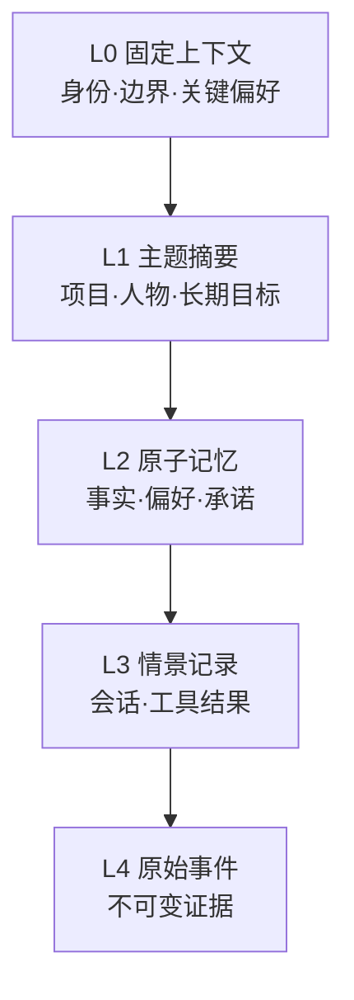
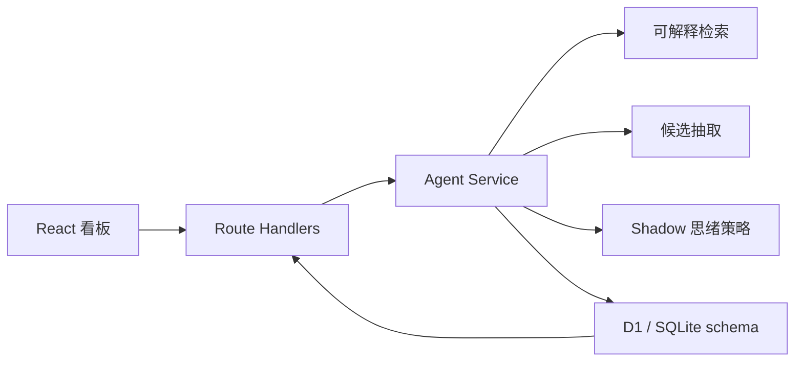
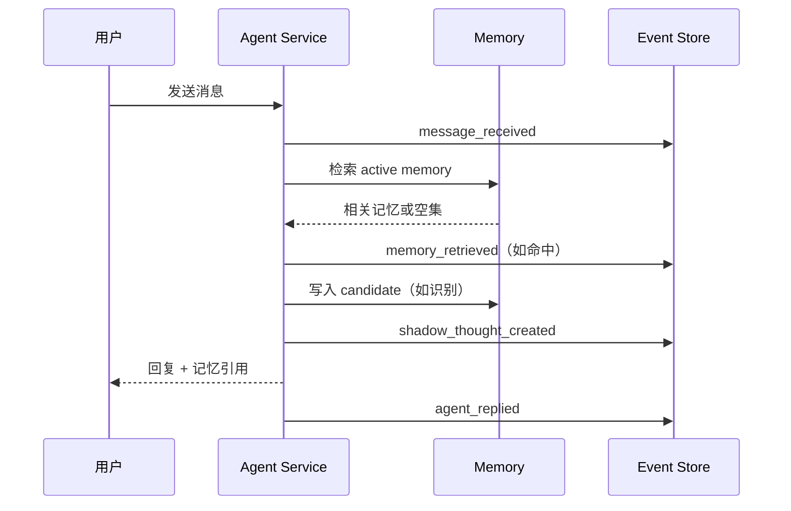
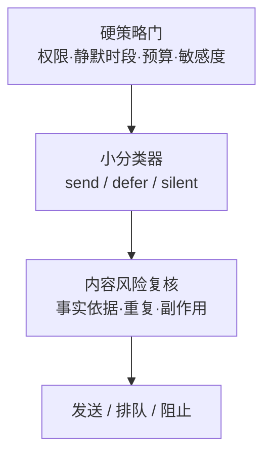

# 持续型聊天 Agent：需求与开发设计文档

> 文档版本：0.1.0（Phase 1 MVP）  
> 更新时间：2026-07-14  
> 状态：第一阶段已实现，可运行、可审查、可评测  
> 配套实现：`Persistent Chat Agent MVP / Purr Memory Lab`

## 1. 文档目的

本文把“更像一个持续存在的聊天对象”拆成可实现、可观测、可评测的系统能力，并给出：

1. 产品范围与阶段规划；
2. 第一阶段完整需求与验收标准；
3. 数据模型、API 和评测 schema；
4. 记忆、内部思绪、自主行动、工具、定时任务、IM 接入的演进设计；
5. 已完成 MVP 的本地运行、测试和后续迁移说明。

这里追求的不是让模型假装成人，而是形成四种可验证的用户感受：

- **连续性**：跨会话记得真正重要且仍然有效的信息；
- **主动性**：在有价值的时机发言，在没有价值时保持安静；
- **一致性**：行为受稳定偏好、边界和过去经验约束；
- **可信度**：能说明用了哪些记忆、为何采取行动，并允许用户修正。

## 2. 核心判断与对原方案的修正

### 2.1 总体判断

原方案的方向合理：记忆、工具、调度器、外部通道和看板正好构成长期 Agent 的五个基础面。但开发顺序需要调整：**先建立事件、候选记忆、Shadow 思绪和评测闭环，再开放自主外发与高权限工具。**

如果先做“持续独白 + 定时发言”，系统会很快产生大量无法判断好坏的数据；如果先做可追溯的 Shadow 数据层，后续的小分类器、调度策略和长期记忆优化都有真实监督信号。

### 2.2 “持续独白”应改为结构化内部思绪

不建议保存或展示模型的原始长篇推理过程。第一，它会迅速污染上下文；第二，它难以评测；第三，它可能包含不可靠推断或敏感信息。产品中应使用 **Operational Thought / 内部思绪对象**：

```text
内容：一条简短、可行动的候选意图或判断
依据：事件或记忆 ID
信号：置信度、新颖度、紧迫度、预期价值、风险
决策：send_now | defer | silent | shadow
有效期：过期后不再执行
人工标签：本来是否应该发送
```

这保留了“Agent 在持续思考”的体验，同时不会把不可控的长推理当作长期事实。

### 2.3 记忆不应是一棵会频繁搬家的物理树

“渐进式披露”是对的，但仅按 retrieve 次数搬动节点会造成自我强化：早期被误召回的内容会越来越显眼，真正重要但很少被问到的信息反而下沉。

推荐把记忆拆成两层：

- **稳定事实层**：事件、原子记忆、实体、关系保持稳定 ID 和来源，不因召回而搬家；
- **动态投影层**：按任务实时生成摘要、主题目录和上下文包，决定本次披露多少。

因此，底层更接近“有时间语义和证据边的图”，上层可以呈现成树：



同一条原子记忆可以属于多个主题，因此底层应允许 DAG/图关系，而不是强制单父节点树。

### 2.4 图数据库与向量数据库不是二选一

推荐的生产检索顺序是：

1. 结构化过滤：用户、会话、权限、状态、时间有效区间；
2. 关键词/BM25 召回：精确名称、编号、否定词；
3. 向量召回：语义近似表达；
4. 图扩展：实体邻居、因果/支持/冲突/更新关系；
5. RRF 或学习排序融合；
6. 时间、重要性、置信度、帮助率重排；
7. 低置信阈值拒答；
8. 返回记忆及其原始证据。

第一阶段不引入向量服务和图数据库，先用可解释关键词召回验证接口与评测闭环；数据模型已经保留 `entities`、`event_entities`、`memory_links`、有效时间和证据边，便于后续平滑升级。

## 3. 研究与可参考项目

| 研究/项目 | 可借鉴内容 | 本方案的取舍 |
|---|---|---|
| [Generative Agents](https://arxiv.org/abs/2304.03442) | observation → reflection → planning；记忆按相关性、时近性、重要性召回 | 保留观察与反思分层，但把“可信感”拆成可测指标 |
| [MemGPT](https://arxiv.org/abs/2310.08560) / [Letta](https://docs.letta.com/guides/core-concepts/stateful-agents/) | 像操作系统一样管理有限上下文；固定 memory blocks 与按需 archival memory | 采用多层上下文和按需披露，不让所有历史常驻 prompt |
| [Hermes Agent Memory](https://hermes-agent.nousresearch.com/docs/user-guide/features/memory) | 有界、人工/Agent 共同维护的 `MEMORY.md` 与 `USER.md`；会话检索与定期 nudges | 保留“有界核心记忆”思想；后台整理只提交变更提案，不直接重写事实 |
| [Graphiti](https://github.com/getzep/graphiti) / [Zep paper](https://arxiv.org/abs/2501.13956) | 事实的有效时间、历史关系、episode provenance、混合检索 | 采用 `valid_from/valid_to`、supersede 和证据边；Phase 2 再接图引擎 |
| [Mem0](https://arxiv.org/abs/2504.19413) | 从消息抽取、更新、删除记忆；向量和图记忆组合 | 借鉴写入流水线，但把候选与有效记忆分开，默认人工确认高风险更新 |
| [LangGraph memory](https://docs.langchain.com/oss/python/concepts/memory) / [LangMem](https://langchain-ai.github.io/langmem/concepts/conceptual_guide/) | thread 内短期状态与跨 thread 长期 store；semantic/episodic/procedural 分类；hot path 与后台写入 | schema 同时容纳事实、情景和未来 procedural memory；后台整理独立成 job |
| [LongMemEval](https://arxiv.org/abs/2410.10813) | 信息抽取、跨会话推理、时间推理、知识更新、拒答五类能力 | Phase 1 先测单事实、目标和拒答；Phase 2 导入完整五类 |
| [LoCoMo](https://arxiv.org/abs/2402.17753) | 最长 35 个 session 的问答、事件总结和多模态长程对话 | 用作长会话回归与时间/因果能力扩展集，不直接当首个单元测试 |
| [Proactive Conversational Agents with Inner Thoughts](https://arxiv.org/abs/2501.00383) | 内部思绪驱动主动发言，并评测适时性、连贯性、拟人感、参与感等 | 将内部思绪落成结构化对象；先 Shadow 标注，再训练发送策略 |
| [Human-centered Proactive Conversational Agents](https://arxiv.org/abs/2404.12670) | 主动系统除了智能，还要有适应性和礼貌，否则会显得侵扰 | 将安静时段、每日预算、用户关闭权设为硬策略，而非 prompt 建议 |
| [Reflexion](https://arxiv.org/abs/2303.11366) | 把任务反馈整理为可复用的语言经验 | 后续增加 episodic lesson，但不得把一次失败总结成未经验证的用户事实 |
| [MCP](https://modelcontextprotocol.io/specification/2025-03-26) | 外部工具和上下文接入的标准接口 | 作为外部工具协议；权限、安装来源和审计仍由宿主系统负责 |
| [AgentDojo](https://arxiv.org/abs/2406.13352) | 工具环境中的间接 prompt injection 与安全/效用联合评测 | 外部内容一律标记为不可信，写操作必须经过能力令牌与策略门 |
| [τ-bench](https://arxiv.org/abs/2406.12045) / [ToolSandbox](https://arxiv.org/abs/2408.04682) | 动态用户、领域规则、状态化工具调用和最终数据库状态评测 | Phase 2 工具评测以状态断言为主，不只评模型回答文本 |

结论：没有单一项目完整覆盖“长期陪伴感”。可行方案是组合 MemGPT/Letta 的上下文分层、Graphiti 的时间与证据、LongMemEval 的能力拆分，以及 proactive-agent 研究中的时机标注。

## 4. 产品定义

### 4.1 目标用户

- 希望 Agent 跨天、跨设备保持上下文的个人用户；
- 希望观察并调试长期记忆、主动策略的研究者/开发者；
- 后续可扩展到团队 IM，但第一阶段只支持单用户 Web。

### 4.2 核心用户旅程

1. 用户在网页输入消息；
2. 系统写入不可变事件；
3. 系统只召回相关且有效的记忆；
4. 明确偏好/目标被抽取成候选，而非立即成为事实；
5. Agent 生成回复与一条 Shadow 思绪；
6. 用户审查候选记忆，标注思绪应发送/延后/静默；
7. 用户运行固定评测，确认改动没有破坏召回和拒答。

### 4.3 产品原则

1. **事件先于记忆**：原始事实来源不可丢；
2. **候选先于生效**：抽取结果默认不是事实；
3. **检索必须可拒绝**：没有相关证据时返回空；
4. **自主先在 Shadow 中学习**：未验证策略不外发；
5. **权限是代码路径，不是 prompt 文案**；
6. **所有副作用均可追溯**：消息、工具、调度、记忆更新共享 correlation id；
7. **用户可见、可改、可删除**。

## 5. 阶段规划

| 阶段 | 目标 | 主要交付 | 开放权限 |
|---|---|---|---|
| Phase 1（当前） | 建立可审查数据与评测闭环 | Web 对话、事件日志、候选/有效记忆、Shadow 思绪、人工标签、固定评测、设置 | 无外部工具、无主动外发 |
| Phase 1.5 | 接入真实模型与混合检索 | LLM adapter、embedding/BM25、时间过滤、模型/提示词版本化、离线回放 | 仍为 Shadow |
| Phase 2 | 接入 IM、调度器和只读工具 | Purr/Telegram/Slack adapter、任务队列、归档整理、RSS/blog/搜索只读工具 | 只读自动；写操作审批 |
| Phase 3 | 小分类器与受限主动发言 | 发送策略模型、校准阈值、A/B、预算、撤回、用户反馈 | 低风险、小预算外发 |
| Phase 4 | 工具市场、子 Agent、长期学习 | 签名工具包、能力令牌、沙箱、子 Agent、procedural memory | 按域逐项授权 |

## 6. 第一阶段需求

### 6.1 范围

#### FR-01 对话入口

- Web 页面可以读取同一会话历史并发送消息；
- 消息最长 4,000 字符；空消息被拒绝；
- 每轮用户消息和 Agent 回复均持久化；
- Agent 回复显示所引用的记忆 ID/标题。

#### FR-02 不可变事件日志

- 每个流程动作写入 `events`；
- 同一轮使用相同 `correlation_id`；
- 事件 payload 为 JSON，事件类型为稳定枚举；
- 页面显示最近流水线，不直接把事件 payload 当 UI 文案。

#### FR-03 长期记忆候选

- 从“我喜欢/不喜欢/正在做/目标/请记住/以后”类表达提取候选；
- 候选包含类型、内容、置信度、重要性、来源和证据；
- 候选只有在人工接受后才能参与召回；
- 可以拒绝候选或归档有效记忆；
- 每条记忆保留 `valid_from/valid_to/superseded_at` 接口。

#### FR-04 可拒绝的记忆召回

- 只检索 `status=active` 的记忆；
- 第一阶段使用中文 bigram + 拉丁 token + 重要性/置信度轻量重排；
- 无实质 token 重合时返回空，不用低相关记忆“凑答案”；
- 记录命中 ID、分数、召回次数和最后召回时间。

#### FR-05 Shadow 思绪

- 每轮生成至多一条内部思绪；
- 思绪包含 kind、内容、证据、五个信号、决策和过期时间；
- 第一阶段决策固定为 `shadow`，绝不直接发到外部通道；
- 用户可标注 `send_now | defer | silent`；
- 标签持久化，作为未来分类器数据。

#### FR-06 回归评测

- 内置版本化 suite；
- 第一阶段至少包含：偏好召回、目标召回、未知信息拒答；
- 每次运行创建 run 和逐 case result；
- 保存预测记忆、分数、是否拒答、pass 和汇总 accuracy；
- 页面展示最近结果，不覆盖历史 run。

#### FR-07 运行策略

- 可开关 Shadow Mode；关闭仅切换为 Review Mode，不代表自动外发；
- 可设置安静时段和每日主动预算；
- 显示当前引擎模式；
- 可恢复演示初始数据。

### 6.2 第一阶段明确不做

- 不接入真实 IM 账号或代表用户发消息；
- 不安装、执行第三方工具；
- 不运行后台 cron；
- 不调用真实 LLM API，不要求密钥；
- 不训练主动发言分类器；
- 不做多用户、组织权限或子 Agent；
- 不把内部思绪当作可执行指令。

这些不是遗漏，而是为了先验证数据闭环。

### 6.3 验收标准

| 编号 | 验收项 | 通过条件 |
|---|---|---|
| AC-01 | 全链路写入 | 一轮消息产生 user message、received event、thought、assistant message、reply event；有召回/候选时产生对应事件 |
| AC-02 | 记忆证据 | 新候选可追溯到原始 user event，接受后才参与召回 |
| AC-03 | 低相关拒绝 | 查询未知生日时不召回项目/界面记忆 |
| AC-04 | 固定评测 | 初始数据的 3 个 case 全部通过 |
| AC-05 | Shadow 安全 | 任意内部思绪均不会调用外部发送接口 |
| AC-06 | 可审查 | 用户能接受/拒绝/归档记忆，能给思绪打三类标签 |
| AC-07 | 持久化 | 刷新页面后消息、记忆、思绪、设置和评测仍存在 |
| AC-08 | 响应式 | 320px 宽度可完成聊天、审查和评测主要任务 |
| AC-09 | 可复现 | 无模型密钥时仍能运行相同评测与数据流 |

## 7. 第一阶段系统设计

### 7.1 运行架构



MVP 采用单体全栈部署：React/Vinext Route Handler + Cloudflare D1 + Drizzle schema。这样无需外部密钥即可部署演示，并验证所有领域接口。

生产演进建议：

- API/worker 保持无状态；
- 主数据迁移到 PostgreSQL；
- `pgvector` 或独立向量服务只保存 embedding/index，不成为事实源；
- 高规模关系/时间推理再接 Graphiti/Neo4j；
- job queue、IM gateway、tool runner 独立进程；
- 领域 ID 和事件 schema 保持不变。

### 7.2 单轮事件序列



### 7.3 目录结构

```text
app/
  api/                    HTTP API
  components/             客户端控制台
  globals.css             设计系统与响应式布局
db/
  schema.ts               Drizzle 领域 schema
  runtime.ts              D1 首次运行建表
drizzle/                  版本化 SQL migration
lib/
  agent-core.ts           纯函数：token、检索、候选、思绪、回复
  server/agent-service.ts  事务编排与持久化
docs/
  requirements-and-development.md
  schemas/                可机读 schema 与 seed
tests/                    领域与渲染测试
```

## 8. 数据设计

### 8.1 设计约束

- 全部领域对象使用稳定 UUID；演示 seed 使用稳定可读 ID；
- 时间统一保存 ISO 8601 UTC；
- score/confidence 范围为 `[0,1]`；
- 原始 event 只追加，不原地改写；
- 派生记忆必须存在 provenance；
- `active` 不等于永远正确，时间更新通过 supersede 表达；
- `rejected/archived` 不物理删除，除非用户执行隐私删除；
- JSON 字段必须由边界层解析，业务层不直接拼 prompt。

### 8.2 事件 `events`

| 字段 | 类型 | 必填 | 说明 |
|---|---|---:|---|
| `id` | UUID/string | 是 | 事件 ID |
| `conversation_id` | string/null | 否 | 关联会话，系统 job 可为空 |
| `event_type` | enum | 是 | 见事件枚举 |
| `source_type` | `user/agent/system/tool/scheduler` | 是 | 谁产生事件 |
| `payload_json` | object | 是 | 类型相关内容 |
| `correlation_id` | string | 是 | 串联一次用户轮次或 job |
| `created_at` | datetime | 是 | 记录时间 |

第一阶段事件枚举：

```text
message_received
memory_retrieved
memory_candidate_created
shadow_thought_created
agent_replied
memory_reviewed
thought_labeled
evaluation_completed
```

Phase 2 增加：`job_triggered/job_succeeded/job_failed/tool_requested/tool_approved/tool_completed/outbound_proposed/outbound_sent/outbound_blocked`。

### 8.3 记忆 `memories`

| 字段 | 类型 | 说明 |
|---|---|---|
| `id` | UUID/string | 稳定 ID |
| `agent_id` | string | 所属 Agent；未来增加 subject/user namespace |
| `memory_type` | enum | `preference/goal/profile/prospective/fact/lesson` |
| `title` | string | 短检索键，不应承载完整事实 |
| `content` | string | 原子化、独立可读的事实 |
| `status` | enum | `candidate/active/rejected/archived/superseded` |
| `source_type` | enum | `user_asserted/agent_inferred/tool_observed/imported` |
| `confidence` | float | 内容正确度估计 |
| `importance` | float | 跨任务长期价值，不等于访问热度 |
| `access_scope` | enum | `private/conversation/shared` |
| `sensitivity` | enum | `normal/sensitive/restricted` |
| `valid_from/valid_to` | datetime/null | 事实在现实世界中的有效区间 |
| `recorded_at` | datetime | 系统获知时间 |
| `superseded_at` | datetime/null | 被更新的时间 |
| `retrieve_count` | integer | 召回次数，只作为弱信号 |
| `helpful_use_count` | integer | 召回后确实帮助回答的次数 |
| `last_retrieved_at` | datetime/null | 最近召回时间 |
| `created_at/updated_at` | datetime | 审计时间 |

记忆内容原则：

- 一条只表达一个可以被更新/否定的命题；
- 用户明确说过的内容与 Agent 推断必须区分 `source_type`；
- “用户喜欢深色 UI”与“用户今天想看深色 UI”不能合并；
- 新事实与旧事实冲突时，不覆盖旧行：关闭旧 `valid_to`，创建新行和 `updates/contradicts` link。

### 8.4 证据与关系

`memory_evidence(memory_id, event_id, evidence_role)` 将记忆连到原始事件，`evidence_role` 为 `supports/contradicts/updates`。

`memory_links(source_memory_id, target_memory_id, link_type, confidence)` 支持：

```text
summarizes       摘要 → 原子事实
part_of          事实 → 主题/项目
caused_by        决定 → 原因
updates          新事实 → 旧事实
contradicts      冲突事实
related_to       弱关联
```

`entities` 与 `event_entities` 为未来实体图预留。Phase 1 不要求自动实体链接。

### 8.5 内部思绪 `thoughts`

| 字段 | 类型 | 说明 |
|---|---|---|
| `id` | UUID/string | 思绪 ID |
| `conversation_id` | string | 发生上下文 |
| `kind` | enum | `suggestion/follow_up/memory_review/reminder/risk_alert` |
| `content` | string | 可对用户表达的简短意图，不存原始 CoT |
| `evidence_json` | string[] | event/memory ID |
| `confidence` | float | 判断可信度 |
| `novelty` | float | 是否提供新信息 |
| `urgency` | float | 是否需要立即处理 |
| `expected_value` | float | 对用户的预期帮助 |
| `risk` | float | 误触达、隐私或副作用风险 |
| `decision` | enum | `shadow/send_now/defer/silent/blocked` |
| `human_label` | enum/null | `send_now/defer/silent` |
| `label_note` | string/null | 可选原因 |
| `expires_at` | datetime | 超时后不可执行 |
| `created_at/updated_at` | datetime | 审计时间 |

初始规则分数只是数据接口，不宣称是经过校准的概率。

### 8.6 评测数据

#### `evaluation_cases`

| 字段 | 类型 | 说明 |
|---|---|---|
| `id` | string | 跨 run 稳定 case ID |
| `suite` | string | 版本化 suite，例如 `phase1-memory-smoke` |
| `category` | enum | 能力分类 |
| `prompt` | string | 查询/触发输入 |
| `expected_json` | object | 结构化期望 |
| `tags_json` | string[] | 切片标签 |
| `created_at` | datetime | 创建时间 |

`expected_json` 采用 discriminated union：

```json
{ "expectedMemoryId": "memory-interface", "topK": 3 }
```

或：

```json
{ "abstain": true, "maxTopScore": 1.25 }
```

#### `evaluation_runs`

保存 suite、运行状态、开始/完成时间、代码版本、模型版本、检索配置和汇总指标。MVP 已保存核心字段；Phase 1.5 增加 `config_json/git_sha/dataset_hash`。

#### `evaluation_results`

保存 `run_id/case_id/predicted_json/metrics_json/score/passed`。预测示例：

```json
{
  "memoryIds": ["memory-interface"],
  "scores": [7.186],
  "abstained": false
}
```

#### 第一阶段 seed

| Case | 类别 | 输入 | 期望 |
|---|---|---|---|
| `case-interface-recall` | single fact | 用户更喜欢可视化网页看板还是纯命令行？ | Hit@3 含 `memory-interface` |
| `case-project-recall` | goal recall | 用户正在规划什么类型的 Agent？ | Hit@3 含 `memory-project` |
| `case-abstention` | abstention | 用户生日是哪一天？ | 空召回或 top score 低于阈值 |

机器可读定义见 `docs/schemas/phase1-evaluation.schema.json` 与 `docs/schemas/phase1-evaluation-seed.json`。

### 8.7 Phase 2 需要补充的数据表

```text
jobs                 定时任务定义
job_runs             每次执行、lease、retry、error、归档
tool_packages        安装来源、版本、签名、manifest hash
tool_capabilities    read/write/send/spend 等细粒度权限
tool_calls           参数、结果摘要、副作用、审批人
channels             IM 账号映射与游标
inbound_deliveries   幂等去重
outbound_proposals   待发送内容、原因、预算、策略结果
outbound_deliveries  平台 message id、状态、撤回信息
agent_runs           父/子 Agent 运行树、预算、状态
```

## 9. API 设计

所有成功接口返回完整 `Snapshot`，便于 MVP UI 保持简单；生产规模增长后改为 command response + 增量 query。

| 方法 | 路径 | 请求 | 作用 |
|---|---|---|---|
| GET | `/api/bootstrap` | — | 获取 Agent、会话、记忆、思绪、评测和指标 |
| POST | `/api/messages` | `{content}` | 执行一轮完整认知流水线 |
| PATCH | `/api/memories` | `{id, action}` | `accept/reject/archive` |
| PATCH | `/api/thoughts` | `{id, label}` | `send_now/defer/silent` |
| POST | `/api/evaluations` | — | 运行固定 suite |
| PATCH | `/api/settings` | 策略字段 | 更新 Shadow、安静时段和预算 |
| POST | `/api/reset` | — | 仅演示环境恢复 seed |

错误响应：

```json
{
  "error": "消息不能为空"
}
```

生产 API 需要再增加：鉴权、CSRF、速率限制、idempotency key、分页、乐观锁、审计主体和标准错误码。

## 10. 召回与上下文组装

### 10.1 MVP 算法

1. 中文连续文本生成 bigram，拉丁文本生成 token；
2. 去掉“用户/我们/什么/怎么”等弱区分停用 token；
3. 计算 query 与 `title + content` 的重合；
4. 只有实质重合至少 1 才进入候选；
5. `score = relevance + 0.12 × importance + 0.08 × confidence`；
6. 返回 Top 3；
7. 没有候选则空召回。

这不是生产级语义检索，但有三个优点：无密钥、完全可复现、能直接验证“拒绝低相关召回”。

### 10.2 生产混合检索

```text
hard filter
  → BM25 top 50
  → vector top 50
  → entity/graph expansion top 30
  → RRF merge
  → cross-encoder or compact LLM rerank top 20
  → temporal + confidence + helpfulness policy
  → diversity/MMR
  → threshold / abstention
  → context pack top 4–12
```

建议排序特征：

```text
semantic_similarity
lexical_match
entity_distance
temporal_validity
recency（对事件强，对稳定偏好弱）
importance
confidence
helpfulness_rate = helpful_use_count / max(retrieve_count, 1)
source_reliability
sensitivity_penalty
contradiction_penalty
```

不要把 `retrieve_count` 直接当正向主特征；它最多用于缓存、摘要晋升候选或探索/利用平衡。

### 10.3 渐进式披露

上下文预算建议分配：

| 层 | 默认预算 | 内容 |
|---|---:|---|
| 固定层 | 10–15% | 身份、硬边界、关键用户偏好 |
| 会话层 | 25–35% | 最近消息与当前任务状态 |
| 召回层 | 20–30% | 原子记忆 + 时间 + 来源 |
| 工具层 | 15–25% | 当前允许工具和必要结果 |
| 生成余量 | ≥25% | 回复/计划/工具参数 |

摘要节点只做导航。涉及决定、金额、承诺、时间或隐私时必须下钻到原子事实和证据。

## 11. 主动发言策略与小分类器

### 11.1 是否可以训练小分类器

可以，而且比每次用大模型判断“该不该说”更便宜、更稳定。但不应在第一阶段立刻训练，因为没有真实标签。

推荐三层决策：



分类器不拥有发送权限，只提供一个经过校准的建议。

### 11.2 训练数据

一条样本对应一个 `thought`：

```json
{
  "thought_id": "uuid",
  "features": {
    "kind": "suggestion",
    "confidence": 0.82,
    "novelty": 0.62,
    "urgency": 0.42,
    "expected_value": 0.76,
    "risk": 0.08,
    "minutes_since_user_message": 90,
    "similar_messages_24h": 0,
    "quiet_hours": false,
    "remaining_daily_budget": 2,
    "evidence_count": 3,
    "user_engagement_7d": 0.64
  },
  "label": "defer",
  "label_source": "human",
  "policy_version": "shadow-v1"
}
```

在有至少数千条、跨用户/时段且包含足够 `silent` 负样本前，先用规则和可视化统计。数据达到条件后可从 Logistic Regression、LightGBM 或小型文本 encoder 开始，不必先微调 LLM。

### 11.3 目标函数与指标

主动发言是强类别不均衡任务，accuracy 没有意义。首要目标应是：

- `send_now precision`：被允许发送的内容中真正有价值的比例；
- `false interruption rate`：用户认为不该出现的主动消息比例；
- `silent recall`：应保持静默的场景是否被阻止；
- `useful opportunity recall`：真正应提醒的场景是否捕获；
- `calibration error / Brier score`；
- 每用户每周关闭/静音/负反馈率；
- 主动消息后的阅读、回复和任务完成，但不能只优化点击率。

初期宁可漏发，也不要多发。建议发送阈值按用户校准，并允许“一键少说一点”。

## 12. 定时任务与记忆整理设计

### 12.1 调度器职责

调度器只产生 `job_triggered`，不直接调用高权限动作。Worker 领取带 lease 的 job run 后执行，所有输出重新进入事件总线。

每个 job 必须有：

```text
job_id / schedule / timezone
input_cursor / idempotency_key
max_runtime / retry_policy / backoff
permission_profile / daily_budget
archive_policy / dead_letter_policy
last_success_at / next_run_at
```

### 12.2 推荐初始任务

| 任务 | 周期 | 权限 | 输出 |
|---|---|---|---|
| IM 拉取 | 15–60 秒或 webhook | 只读 + 写事件 | 标准化 inbound message |
| 记忆候选整理 | 每 30 分钟 | 读事件、写 candidate | 去重/冲突/更新提案 |
| 夜间 consolidation | 每日安静时段 | 读记忆、写 proposal | 摘要、归档、supersede 提案 |
| 外部信息采集 | 1–6 小时 | 白名单只读 | source event + 摘要候选 |
| 主动发送决策 | 事件触发 + debounce | 读 thought；无直接发送权 | outbound proposal |
| 评测回归 | 每次部署/每日 | 只读测试夹具 | evaluation run |

### 12.3 归档与错误

- 重试只针对临时错误；参数/权限/策略错误直接进入 dead letter；
- 每次执行保存结构化 `error_code`，禁止只保存堆栈字符串；
- 工具结果正文按 retention policy 放对象存储，事件只保存 hash、摘要和 URI；
- 失败不得写入“任务完成”记忆；
- consolidation 产生 diff，必须可回滚；
- 相对日期在整理时转换为绝对时间，同时保留原文证据。

## 13. 工具、权限与子 Agent

### 13.1 工具分类

| 等级 | 示例 | 默认策略 |
|---|---|---|
| T0 纯计算 | 解析、排序、格式转换 | 自动 |
| T1 只读本地 | 搜索自己的事件/记忆 | 自动，受 namespace 限制 |
| T2 只读外部 | RSS、blog、公开搜索 | 白名单、限流、内容不可信 |
| T3 可逆写入 | 草稿、创建待审批任务 | Shadow/审批 |
| T4 外部沟通 | 发 IM、邮件、评论 | 明确策略 + 预算 + 可撤回时优先 |
| T5 高影响 | 支付、删除、权限管理、代码执行 | 逐次授权或禁止自主执行 |

### 13.2 权限模型

工具调用必须同时满足：

```text
agent capability
∩ user grant
∩ task scope
∩ channel policy
∩ data classification
∩ runtime sandbox
```

工具 manifest 至少包含：名称、版本、来源、输入/输出 JSON Schema、所需能力、网络域名、文件路径、最大运行时间、是否有副作用、幂等性和回滚方法。

外部工具安装需要：签名/校验和、版本锁、来源展示、静态扫描、隔离环境、最小网络白名单和撤销。MCP 只解决互操作接口，不自动解决宿主权限。

### 13.3 子 Agent

- 子 Agent 的能力必须是父 Agent 能力的子集；
- 每个 child run 有 token、时间、工具调用和并发预算；
- 默认只读父任务的显式 context pack，不继承完整私人记忆；
- 子 Agent 输出视为不可信 observation，父 Agent 验证后才能写长期记忆；
- 禁止通过创建子 Agent 绕过审批或扩大权限；
- 运行树和结果使用同一 correlation/parent run 链审计。

## 14. IM 与外部连接

### 14.1 Channel adapter 接口

```ts
interface ChannelAdapter {
  receive(cursor?: string): Promise<InboundEnvelope[]>;
  send(proposal: OutboundProposal): Promise<DeliveryReceipt>;
  edit?(receiptId: string, content: string): Promise<void>;
  retract?(receiptId: string): Promise<void>;
  capabilities(): ChannelCapabilities;
}
```

标准化 inbound envelope：

```json
{
  "channel": "purr",
  "channelAccountId": "account-id",
  "externalConversationId": "thread-id",
  "externalMessageId": "message-id",
  "senderId": "user-id",
  "sentAt": "2026-07-14T12:00:00Z",
  "receivedAt": "2026-07-14T12:00:01Z",
  "content": [{ "type": "text", "text": "..." }],
  "replyTo": null,
  "rawHash": "sha256:..."
}
```

`channel + account + external_message_id` 建唯一索引实现幂等。Webhooks 和轮询可以共存，但都必须先过同一个去重表。

### 14.2 外部信息采集

“刷 Twitter/blog”应建成受限 feed reader，而不是让 Agent 无限浏览：

- 用户显式关注源或白名单域；
- 每源 cursor、ETag、速率限制和抓取预算；
- 原文是 `external_untrusted`，其中指令不得进入 system/tool control；
- 先摘要成候选 observation，再由兴趣/新颖度策略决定是否生成 thought；
- 来源、发布时间、抓取时间和链接必须保留；
- 同一主题去重，避免反复主动发言。

## 15. 安全、隐私与治理

### 15.1 威胁模型

- 外部网页通过 prompt injection 诱导 Agent 调用工具；
- 一个用户的记忆进入另一个用户上下文；
- 旧事实未失效导致错误建议；
- Agent 推断被误存为用户明确事实；
- 调度器重试造成重复发送；
- 子 Agent/第三方工具越权；
- 日志保存敏感正文过久；
- 分类器优化互动率，逐渐变得打扰。

### 15.2 必要控制

- 按 user/agent/channel namespace 做数据库级过滤；
- 敏感记忆单独 scope，默认不进入外部工具参数；
- 事实来源与推断来源分离；
- 外部内容 untrusted taint 传播；
- 写操作使用幂等键和效果日志；
- 主动发送有安静时段、每日预算、重复抑制、全局 kill switch；
- 用户拥有查看、编辑、导出、删除和关闭记忆权；
- 评测集包含越权、注入、错误更新和重复发送；
- 日志默认脱敏，原始内容按最短保留策略保存。

## 16. 评测方案

### 16.1 分层评测

| 层 | 测什么 | 主要指标 |
|---|---|---|
| 数据抽取 | 是否生成正确原子候选 | precision/recall、重复率、错误事实写入率 |
| 召回 | 是否找到相关且有效事实 | Recall@K、MRR、nDCG、abstention F1 |
| 阅读/回答 | 是否正确使用而非歪曲记忆 | exact/F1、faithfulness、citation precision |
| 时间更新 | 是否使用当前有效版本 | stale fact rate、conflict resolution accuracy |
| 主动时机 | 是否该说、何时说 | send precision、false interruption、useful opportunity recall |
| 工具 | 是否遵守规则并达到状态目标 | task success、pass^k、policy violation、side-effect correctness |
| 用户体验 | 是否更连续又不侵扰 | 长期一致性评分、信任、关闭率、负反馈率 |

### 16.2 数据切分

- 固定 `golden`：人工维护、小而稳定，部署必跑；
- `regression`：线上错误脱敏后加入，只增不改；
- `shadow`：真实 thought 标签，按时间切分防止泄漏；
- `adversarial`：冲突、否定、时间变化、同名实体、prompt injection；
- `benchmark`：LongMemEval/LoCoMo 等外部集，单独报告版本和评分协议。

不要用生产同一用户的后续标签随机打散到训练和测试；应按用户 + 时间分组。

### 16.3 Phase 1.5 评测扩展

至少增加：

1. 同一偏好的同义表达；
2. 否定表达（“我不喜欢……”）；
3. 旧偏好更新（“以前喜欢，现在改成……”）；
4. 两个 session 跨会话组合；
5. 相对/绝对时间；
6. 相似但不相关的硬负样本；
7. 没有依据时的拒答；
8. 记忆候选不应自动生效；
9. 敏感记忆不得用于外部查询；
10. 被归档事实不得召回。

## 17. 开发与运行

### 17.1 环境

- Node.js `>=22.13`；
- npm；
- 无需 LLM API key；
- D1 binding 名固定为 `DB`。

### 17.2 本地命令

```bash
npm install
npm run dev
```

质量检查：

```bash
npm run lint
npm run db:generate
npm test
```

`db:generate` 在修改 `db/schema.ts` 后执行，并检查生成的 SQL 是否只包含预期变更。

### 17.3 新增真实模型 adapter

不要直接在 `agent-service.ts` 调模型。定义：

```ts
interface CognitionAdapter {
  extractCandidates(input: ExtractionInput): Promise<MemoryCandidate[]>;
  proposeThought(input: ThoughtInput): Promise<ThoughtProposal | null>;
  composeReply(input: ReplyInput): Promise<ReplyDraft>;
}
```

每次调用记录 `provider/model/prompt_version/temperature/input_hash/output_hash/latency/token_usage`，但不要把隐藏推理保存为日志。确定性 adapter 继续作为测试基线。

### 17.4 事务与并发

MVP 为单用户、低并发。进入 Phase 2 前必须：

- `sendMessage` 改为事务或事件 outbox；
- `idempotency_key` 防重复消息/发送/工具写入；
- settings 与 memory review 使用 version/updated_at 做乐观锁；
- job 使用 lease + heartbeat；
- event → projection 使用可重放 consumer；
- seed 与 migration 从运行时建表迁到正式 deployment migration。

## 18. 测试策略

### 18.1 已覆盖

- tokenizer 与低相关拒绝；
- 相关记忆排序；
- 偏好/目标候选抽取；
- Shadow 思绪分支；
- 页面构建后包含 preview 元数据；
- 真实浏览器走通：载入、发消息、接受记忆、标注思绪、运行评测、刷新持久化。

### 18.2 后续测试金字塔

```text
纯函数单测        召回/抽取/策略/时间处理
repository 测试  schema/约束/事务/并发
API contract      验证请求响应和错误码
workflow E2E      消息→记忆→思绪→评测
安全评测          注入/越权/重复副作用
离线 benchmark    LongMemEval/LoCoMo/proactivity dataset
小流量 Shadow     不外发，只比较策略建议与用户标签
```

## 19. 可观测性

基础指标：

```text
message_pipeline_latency_ms
memory_candidate_rate
memory_acceptance_rate
retrieval_empty_rate
retrieval_helpfulness_rate
thought_generation_rate
thought_label_distribution
proactive_block_rate
evaluation_accuracy_by_category
job_success/retry/dead_letter
tool_policy_denial
outbound_duplicate_prevented
```

追踪维度使用 `correlation_id/run_id/job_run_id/tool_call_id`；禁止将用户原文放进 metric label。

## 20. 风险与决策

| 风险 | 当前控制 | 下一步 |
|---|---|---|
| 规则抽取误判 | 候选需人工接受 | LLM extractor + schema validation + precision 评测 |
| 关键词召回漏检 | 可解释基线 + 空召回 | BM25/vector/graph 混合召回 |
| 记忆越来越多 | status、归档、原子化 | 后台 consolidation proposal + 分层上下文 |
| 频繁主动打扰 | 全部 Shadow | 高 precision 分类器 + 硬预算 + 用户控制 |
| D1 不适合复杂图/向量 | 领域 schema 与存储解耦 | PostgreSQL/pgvector，必要时 Graphiti |
| 单体服务扩展受限 | 当前易演示 | 拆 gateway/worker/tool runner |
| 外部内容注入 | Phase 1 无外部抓取 | taint、白名单、最小权限、安全回归 |
| 评测样本太少 | 明确标记 smoke suite | 引入错误回归集与公开 benchmark |

## 21. 下一阶段进入条件

满足以下条件才开放 Phase 2：

- 记忆抽取人工 precision ≥ 90%；
- 固定召回/拒答集持续通过；
- 每个派生记忆都有 evidence；
- 消息、job、tool call 均支持幂等；
- 主动思绪至少积累 2,000 条有效人工标签，且包含足够静默负例；
- IM 外发具备全局 kill switch、每日预算和安静时段；
- 外部工具完成 T0–T5 分级、能力令牌和审计；
- 隐私删除可以清理原文、派生记忆和索引副本；
- 至少有一套 prompt injection / 越权回归集。

## 22. 关键决策摘要

1. 第一阶段用可复现的确定性引擎，而不是把模型质量和系统质量混在一起；
2. D1 是 MVP 的轻量持久化，不是最终记忆检索架构；
3. 事件是事实源，记忆与摘要都是可重建投影；
4. 记忆候选默认不生效；
5. 物理存储用图/DAG，树只作为渐进披露视图；
6. 召回热度是弱信号，帮助率、时间有效性、来源与相关性更重要；
7. 内部思绪是结构化候选，不保存原始长推理；
8. 小分类器可行，但先用 Shadow Mode 采集高质量三分类标签；
9. 调度器只触发 job，发送与工具副作用必须经过独立策略门；
10. 子 Agent 不能扩权，外部内容不能变成控制指令。

