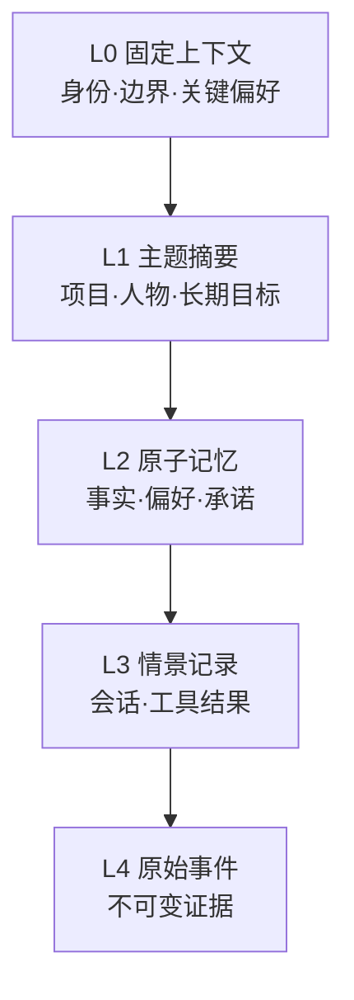
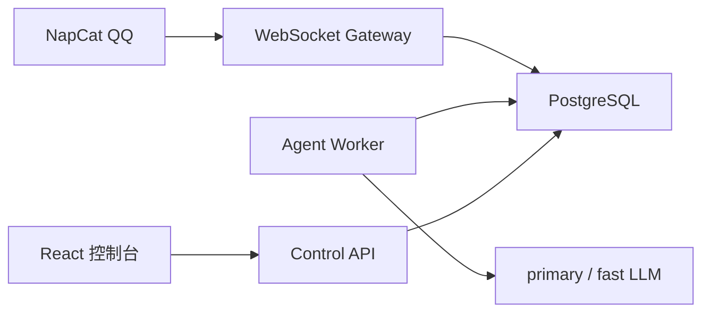
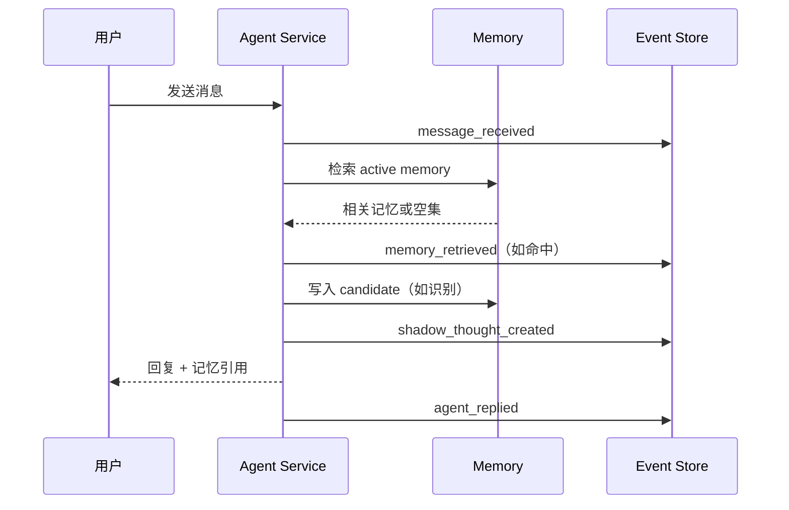
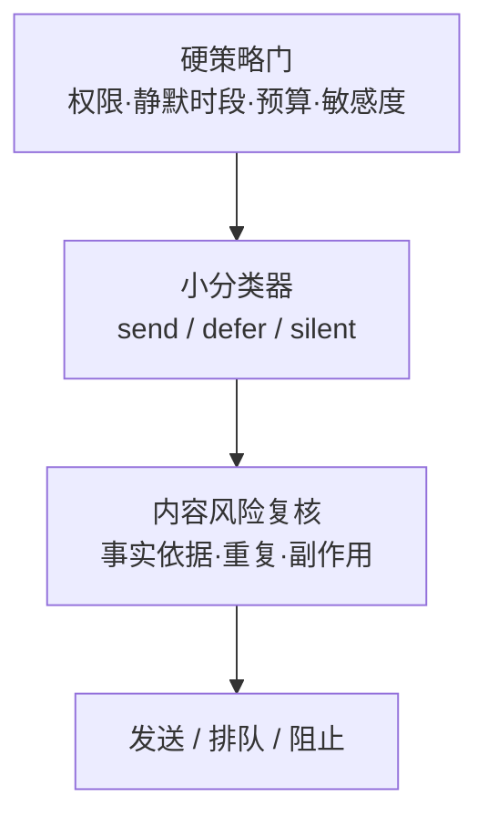

# Asuka Agent：需求与开发设计文档

> 文档版本：0.6.0（Thought Stream v2 与两阶段认知设计）
>
> 更新时间：2026-07-15
>
> 状态：NapCat QQ 入站、IM Channel、双档 LLM 和单轮定时认知已进入本地验证；Thought Stream v2、正式记忆召回与自主外发为已确认的下一阶段设计
>
> 配套实现：`Asuka Agent`

## 1. 文档目的

本文把“更像一个持续存在的聊天对象”拆成可实现、可观测、可评测的系统能力，并给出：

1. 产品范围与阶段规划；
2. 第一阶段完整需求与验收标准；
3. 数据模型、API 和可观测性约束；
4. 记忆、内部思绪、自主行动、工具、定时任务、IM 接入的演进设计；
5. 已完成 MVP 的本地运行、测试和后续迁移说明。

这里追求的不是让模型假装成人，而是形成四种可验证的用户感受：

- **连续性**：跨会话记得真正重要且仍然有效的信息；
- **主动性**：在有价值的时机发言，在没有价值时保持安静；
- **一致性**：行为受稳定偏好、边界和过去经验约束；
- **可信度**：能说明用了哪些记忆、为何采取行动，并允许用户修正。

## 2. 核心判断与对原方案的修正

### 2.1 总体判断

原方案的方向合理：记忆、工具、调度器、外部通道和看板正好构成长期 Agent 的五个基础面。但开发顺序需要调整：**先建立事件、候选记忆和可追踪思绪运行，再开放召回、自主外发与高权限工具。**

如果先做“持续独白 + 定时发言”，系统会很快产生大量无法判断好坏的数据。当前先保留真实触发、模型调用、上下文、引用和模型可见输出；数据标注与评测是后续独立工作流，不混入普通思绪查看。

### 2.2 “持续独白”应改为可审计的自然思绪流

不保存模型供应商不可见的隐藏推理，也不要求模型逐 token 输出私有 chain-of-thought。产品中的思绪是主模型显式生成的自然认知工作记录：保留观察、联想、不确定性、互动意图、依据和行动草稿，不用严格 JSON 束缚表达。一次 trigger 形成一个可审计的 **Thought Turn / Thought Run**，其中可以包含多轮主模型调用、记忆召回、只读工具调用、fast 动作编译和外部 source 检索。

认知输出与动作控制分层：

```text
primary：自然思绪 + 只读工具循环 + 自然回复/记忆草稿
fast：将 primary 原文编译为严格 action proposals
server：身份/证据/权限/预算/幂等校验
executor：只执行通过策略门的副作用
```

fast 不替 primary 补充思想或润色回复。如果它发现必要信息缺失，应返回可操作的 revision reasons，由 primary 有界修订；`no_action` 是正常结果。发送消息、激活记忆等副作用不由模型直接执行。

```text
触发：schedule | manual | message | keyword | future trigger
过程：一轮或多轮 llm_call / memory_retrieval / tool_call / source_retrieval
上下文：每轮实际输入，以及引用的 message / memory / external source
消耗：每轮 model、延迟、input/output token
结果：简短结论、决策、可验证证据和有效期
```

`operational_thoughts` 只是 Thought Run 可能产生的一个可执行结论，不再代表整个思绪过程。数据标注如需引入，必须使用独立页面和独立权限。

### 2.3 记忆不应是一棵会频繁搬家的物理树

“渐进式披露”是对的，但仅按 retrieve 次数搬动节点会造成自我强化：早期被误召回的内容会越来越显眼，真正重要但很少被问到的信息反而下沉。

推荐把记忆拆成两层：

- **稳定事实层**：事件、原子记忆、实体、关系保持稳定 ID 和来源，不因召回而搬家；
- **动态投影层**：按任务实时生成摘要、主题目录和上下文包，决定本次披露多少。

因此，底层更接近“有时间语义和证据边的图”，上层可以呈现成树：



同一条原子记忆可以属于多个主题，因此底层应允许 DAG/图关系，而不是强制单父节点树。

### 2.4 图数据库与向量数据库不是二选一

推荐的生产检索顺序是：

1. 结构化过滤：用户、会话、权限、状态、时间有效区间；
2. 关键词/BM25 召回：精确名称、编号、否定词；
3. 向量召回：语义近似表达；
4. 图扩展：实体邻居、因果/支持/冲突/更新关系；
5. RRF 或学习排序融合；
6. 时间、重要性、置信度、帮助率重排；
7. 低置信阈值拒答；
8. 返回记忆及其原始证据。

当前阶段不引入向量服务和图数据库，也不宣称已经完成召回。现有 worker 只从新增消息生成带证据的 `memory_candidates`；正式记忆库、激活审核、混合召回和上下文注入将在独立里程碑实现。

## 3. 研究与可参考项目

| 研究/项目 | 可借鉴内容 | 本方案的取舍 |
|---|---|---|
| [Generative Agents](https://arxiv.org/abs/2304.03442) | observation → reflection → planning；记忆按相关性、时近性、重要性召回 | 保留观察与反思分层，但把“可信感”拆成可测指标 |
| [MemGPT](https://arxiv.org/abs/2310.08560) / [Letta](https://docs.letta.com/guides/core-concepts/stateful-agents/) | 像操作系统一样管理有限上下文；固定 memory blocks 与按需 archival memory | 采用多层上下文和按需披露，不让所有历史常驻 prompt |
| [Hermes Agent Memory](https://hermes-agent.nousresearch.com/docs/user-guide/features/memory) | 有界、人工/Agent 共同维护的 `MEMORY.md` 与 `USER.md`；会话检索与定期 nudges | 保留“有界核心记忆”思想；后台整理只提交变更提案，不直接重写事实 |
| [Graphiti](https://github.com/getzep/graphiti) / [Zep paper](https://arxiv.org/abs/2501.13956) | 事实的有效时间、历史关系、episode provenance、混合检索 | 采用 `valid_from/valid_to`、supersede 和证据边；Phase 2 再接图引擎 |
| [Mem0](https://arxiv.org/abs/2504.19413) | 从消息抽取、更新、删除记忆；向量和图记忆组合 | 借鉴写入流水线，但把候选与有效记忆分开，默认人工确认高风险更新 |
| [LangGraph memory](https://docs.langchain.com/oss/python/concepts/memory) / [LangMem](https://langchain-ai.github.io/langmem/concepts/conceptual_guide/) | thread 内短期状态与跨 thread 长期 store；semantic/episodic/procedural 分类；hot path 与后台写入 | schema 同时容纳事实、情景和未来 procedural memory；后台整理独立成 job |
| [LongMemEval](https://arxiv.org/abs/2410.10813) | 信息抽取、跨会话推理、时间推理、知识更新、拒答五类能力 | Phase 1 先测单事实、目标和拒答；Phase 2 导入完整五类 |
| [LoCoMo](https://arxiv.org/abs/2402.17753) | 最长 35 个 session 的问答、事件总结和多模态长程对话 | 用作长会话回归与时间/因果能力扩展集，不直接当首个单元测试 |
| [Proactive Conversational Agents with Inner Thoughts](https://arxiv.org/abs/2501.00383) | 内部思绪驱动主动发言，并评测适时性、连贯性、拟人感、参与感等 | 将内部思绪落成结构化对象；先 Shadow 标注，再训练发送策略 |
| [Human-centered Proactive Conversational Agents](https://arxiv.org/abs/2404.12670) | 主动系统除了智能，还要有适应性和礼貌，否则会显得侵扰 | 将安静时段、每日预算、用户关闭权设为硬策略，而非 prompt 建议 |
| [Reflexion](https://arxiv.org/abs/2303.11366) | 把任务反馈整理为可复用的语言经验 | 后续增加 episodic lesson，但不得把一次失败总结成未经验证的用户事实 |
| [MCP](https://modelcontextprotocol.io/specification/2025-03-26) | 外部工具和上下文接入的标准接口 | 作为外部工具协议；权限、安装来源和审计仍由宿主系统负责 |
| [AgentDojo](https://arxiv.org/abs/2406.13352) | 工具环境中的间接 prompt injection 与安全/效用联合评测 | 外部内容一律标记为不可信，写操作必须经过能力令牌与策略门 |
| [τ-bench](https://arxiv.org/abs/2406.12045) / [ToolSandbox](https://arxiv.org/abs/2408.04682) | 动态用户、领域规则、状态化工具调用和最终数据库状态评测 | Phase 2 工具评测以状态断言为主，不只评模型回答文本 |

结论：没有单一项目完整覆盖“长期陪伴感”。可行方案是组合 MemGPT/Letta 的上下文分层、Graphiti 的时间与证据、LongMemEval 的能力拆分，以及 proactive-agent 研究中的时机标注。

## 4. 产品定义

### 4.1 目标用户

- 希望 Agent 跨天、跨设备保持上下文的个人用户；
- 希望观察并调试长期记忆、主动策略的研究者/开发者；
- 当前首先支持白名单 QQ 群和私聊，Web 仅作为本地控制台。

### 4.2 核心用户旅程

1. NapCat 将白名单会话消息经 WebSocket 送入本地接收箱；
2. worker 幂等投影消息，并由定时或手动 trigger 创建 job run；
3. 每个有新增消息的会话创建一个 Thought Run；
4. Thought Run 记录每轮模型上下文、token 与引用来源；
5. 记忆沉淀思绪可以生成待审候选，但候选不会自动生效；
6. 用户在 Web 控制台检查 IM、思绪、记忆候选和任务运行。

### 4.3 产品原则

1. **事件先于记忆**：原始事实来源不可丢；
2. **候选先于生效**：抽取结果默认不是事实；
3. **检索必须可拒绝**：没有相关证据时返回空；
4. **自主先在 Shadow 中学习**：未验证策略不外发；
5. **权限是代码路径，不是 prompt 文案**；
6. **所有副作用均可追溯**：消息、工具、调度、记忆更新共享 correlation id；
7. **用户可见、可改、可删除**。

## 5. 阶段规划

| 阶段 | 目标 | 主要交付 | 开放权限 |
|---|---|---|---|
| Phase 1（已完成） | 建立可靠消息事实源 | NapCat QQ、PostgreSQL 接收箱、会话投影、IM 页面、双档 LLM 设置 | 无外部工具、无主动外发 |
| Phase 2（当前） | 跑通可追踪认知 MVP | 定时任务、Thought Run、多轮调用模型、上下文/来源审计、记忆候选 | 仍不外发；候选不自动激活 |
| Phase 2.5 | 正式记忆与召回 | 审核状态机、原子记忆、BM25/vector、时间过滤、召回工具 | 只读召回 |
| Phase 3 | 小分类器与受限主动发言 | 发送策略模型、校准阈值、A/B、预算、撤回、用户反馈 | 低风险、小预算外发 |
| Phase 4 | 工具市场、子 Agent、长期学习 | 签名工具包、能力令牌、沙箱、子 Agent、procedural memory | 按域逐项授权 |

## 6. 第一阶段需求

### 6.1 范围

#### FR-01 IM 消息入口

- NapCat 正向 WebSocket 只接收白名单群和联系人；
- 原始 delivery 先幂等写入 PostgreSQL，再投影为会话消息；
- 消息保留稳定 sender ID、当时显示名、回复目标和原始 payload；
- Web 控制台读取真实会话历史和未读状态。

#### FR-02 不可变事件日志

- 每个流程动作写入 `events`；
- 同一轮使用相同 `correlation_id`；
- 事件 payload 为 JSON，事件类型为稳定枚举；
- 页面显示最近流水线，不直接把事件 payload 当 UI 文案。

#### FR-03 长期记忆候选

- 记忆候选只能由一个 Thought Run 产生，并保存 `thought_run_id`；
- 候选区分 `source_speaker_id` 与 `subject_id`，歧义对象保持 unresolved；
- 候选保存原始 message evidence、操作类型、置信度和 prompt version；
- 当前只生成 `pending_review` 候选，不自动激活或覆盖事实。

#### FR-04 正式记忆召回（暂缓）

- 当前 PostgreSQL 链路尚无 active memory store，也不执行记忆召回；
- 后续只检索已审核、有效且权限匹配的记忆；
- 召回必须作为 Thought Run 的一个可见步骤，记录 query、命中、分数和证据；
- 无可靠结果时返回空，不用低相关记忆凑上下文。

#### FR-05 思绪运行

- 每个 conversation + job run 最多创建一个 Thought Run；
- 保存 trigger 类型、原因、时间、状态、简短结论和决策；
- 支持一轮或多轮 LLM 调用，每轮保存实际上下文、模型输出、延迟和 token；
- message、memory、tool、external source 都以结构化 context item 引用；
- 普通查看不提供数据标注；未来标注台必须独立实现。

#### FR-06 回归评测（暂缓）

- 当前不提供评测页面、固定 seed 或 evaluation API；
- 等正式记忆召回和回复模式稳定后，再建立版本化数据集与离线回放；
- 评测数据与正常运行数据分开保存和展示。

#### FR-07 模型与运行策略

- 主模型与快速模型分别配置 URL、Key、model ID 和上下文长度；
- API Key 加密保存且不通过 API 回填；
- 调度任务仅引用 profile，不绑定具体模型；
- 当前没有演示 seed，也没有恢复演示数据入口。

### 6.2 第一阶段明确不做

- 不代表用户主动发消息；
- 不安装、执行第三方工具；
- 不训练主动发言分类器；
- 不做正式记忆激活、召回、评测、组织权限或子 Agent；
- 不把内部思绪当作可执行指令。

这些不是遗漏，而是为了先验证数据闭环。

### 6.3 验收标准

| 编号 | 验收项 | 通过条件 |
|---|---|---|
| AC-01 | 全链路写入 | 白名单消息经接收箱投影到 PostgreSQL 会话且幂等 |
| AC-02 | 思绪过程 | 每个处理会话留下 trigger、至少一轮调用或明确失败状态、token 和上下文 |
| AC-03 | 记忆来源 | 每条候选关联 Thought Run、source speaker、subject 与 message evidence |
| AC-04 | 归因安全 | 多人群聊不因昵称、转述或代词把事实强行绑定给错误用户 |
| AC-05 | 外发安全 | 任意思绪与候选均不会调用外部发送接口 |
| AC-06 | 增量幂等 | watermark 后无新消息的重跑不再次调用模型 |
| AC-07 | 单一数据源 | 运行时只使用 PostgreSQL，不包含 D1 seed 或第二套业务数据 |
| AC-08 | 响应式 | 320px 宽度可查看 IM、思绪、记忆候选和任务状态 |

## 7. 第一阶段系统设计

### 7.1 运行架构



PostgreSQL 是唯一业务事实源。Web 不包含业务 Route Handler，也不持有第二套数据库；它通过本机 control API 查看真实 IM、任务、思绪、模型调用与记忆候选。D1、演示 seed、OpenAI Sites 和 Cloudflare Worker 部署方案已删除。

后续演进建议：

- API/worker 保持无状态；
- 主数据迁移到 PostgreSQL；
- `pgvector` 或独立向量服务只保存 embedding/index，不成为事实源；
- 高规模关系/时间推理再接 Graphiti/Neo4j；
- job queue、IM gateway、tool runner 独立进程；
- 领域 ID 和事件 schema 保持不变。

### 7.2 单轮事件序列



### 7.3 目录结构

```text
apps/
  web/                    Vinext 本地控制台 UI
  control-api/            PostgreSQL 查询与控制面
  napcat-gateway/         OneBot WebSocket adapter
  agent-worker/           入站投影与后续调度执行器
packages/
  agent-core/             纯领域策略：检索、候选、思绪、回复
  db/                     PostgreSQL schema、migration、数据库脚本
  im/                     QQ/OneBot 消息标准化
  config/                 进程环境变量解析与校验
  llm/                    primary/fast LLM adapter、校验与密钥加密
  shared/                 稳定通用代码
docs/
  requirements-and-development.md
scripts/                  workspace 边界与必要运维脚本
```

根目录只负责编排，使用一个 `package-lock.json`。Workspace 间仅通过声明过的 `@asuka-agent/*` 公开 exports 依赖；相对路径越界、私有子路径和循环依赖由 `make check` 阻止。数据库结构与 migration 由 `packages/db` 唯一所有。

## 8. 数据设计

### 8.1 设计约束

- 全部领域对象使用稳定 UUID 或稳定平台 ID；不写入演示 seed；
- 时间统一保存 PostgreSQL `timestamptz`；
- confidence 在 PostgreSQL 中使用 `[0,1000]` 整数避免浮点漂移；
- 原始 event 只追加，不原地改写；
- 派生记忆必须存在 provenance；
- `active` 不等于永远正确，时间更新通过 supersede 表达；
- `rejected/archived` 不物理删除，除非用户执行隐私删除；
- JSON 字段必须由边界层解析，业务层不直接拼 prompt。

### 8.2 事件 `events`

| 字段 | 类型 | 必填 | 说明 |
|---|---|---:|---|
| `id` | UUID/string | 是 | 事件 ID |
| `conversation_id` | string/null | 否 | 关联会话，系统 job 可为空 |
| `event_type` | enum | 是 | 见事件枚举 |
| `source_type` | `user/agent/system/tool/scheduler` | 是 | 谁产生事件 |
| `payload_json` | object | 是 | 类型相关内容 |
| `correlation_id` | string | 是 | 串联一次用户轮次或 job |
| `created_at` | datetime | 是 | 记录时间 |

当前事件枚举：

```text
message_received
memory_candidate_created
operational_thought_created
```

后续增加：`memory_retrieved/tool_requested/tool_approved/tool_completed/outbound_proposed/outbound_sent/outbound_blocked`。job 的状态变化当前直接记录在 `job_runs`，避免重复事实源。

### 8.3 正式记忆 `memories`（目标设计，当前未建表）

| 字段 | 类型 | 说明 |
|---|---|---|
| `id` | UUID/string | 稳定 ID |
| `agent_id` | string | 所属 Agent；未来增加 subject/user namespace |
| `memory_type` | enum | `preference/goal/profile/prospective/fact/lesson` |
| `title` | string | 短检索键，不应承载完整事实 |
| `content` | string | 原子化、独立可读的事实 |
| `status` | enum | `candidate/active/rejected/archived/superseded` |
| `source_type` | enum | `user_asserted/agent_inferred/tool_observed/imported` |
| `confidence` | float | 内容正确度估计 |
| `importance` | float | 跨任务长期价值，不等于访问热度 |
| `access_scope` | enum | `private/conversation/shared` |
| `sensitivity` | enum | `normal/sensitive/restricted` |
| `valid_from/valid_to` | datetime/null | 事实在现实世界中的有效区间 |
| `recorded_at` | datetime | 系统获知时间 |
| `superseded_at` | datetime/null | 被更新的时间 |
| `retrieve_count` | integer | 召回次数，只作为弱信号 |
| `helpful_use_count` | integer | 召回后确实帮助回答的次数 |
| `last_retrieved_at` | datetime/null | 最近召回时间 |
| `created_at/updated_at` | datetime | 审计时间 |

记忆内容原则：

- 一条只表达一个可以被更新/否定的命题；
- 用户明确说过的内容与 Agent 推断必须区分 `source_type`；
- “用户喜欢深色 UI”与“用户今天想看深色 UI”不能合并；
- 新事实与旧事实冲突时，不覆盖旧行：关闭旧 `valid_to`，创建新行和 `updates/contradicts` link。

当前实际表为 `memory_candidates`：保存 `thought_run_id`、`operation`、`subject_id`、`source_speaker_id`、`claim`、`evidence_message_ids`、置信度、归因状态和 `pending_review` 状态。候选不会参与召回；正式记忆审核与物化将在后续 migration 实现。

### 8.4 证据与关系

`memory_evidence(memory_id, event_id, evidence_role)` 将记忆连到原始事件，`evidence_role` 为 `supports/contradicts/updates`。

`memory_links(source_memory_id, target_memory_id, link_type, confidence)` 支持：

```text
summarizes       摘要 → 原子事实
part_of          事实 → 主题/项目
caused_by        决定 → 原因
updates          新事实 → 旧事实
contradicts      冲突事实
related_to       弱关联
```

`entities` 与 `event_entities` 为未来实体图预留。Phase 1 不要求自动实体链接。

### 8.5 思绪运行与模型轮次

| 字段 | 类型 | 说明 |
|---|---|---|
| `thought_runs.id` | string | 一次完整认知过程 ID |
| `conversation_id/job_run_id` | string | 会话与批任务来源 |
| `trigger_type/reason` | string | 定时、手动、消息、关键词等触发及原因 |
| `status/decision/summary` | string | 运行状态与面向用户的简短结论 |
| `started_at/completed_at` | datetime | 过程耗时边界 |
| `llm_calls.thought_run_id` | string | 每轮模型调用归属 |
| `sequence_number` | integer | 同一思绪内的模型轮次 |
| `request_context` | jsonb | 实际发送给模型的 role/content 列表 |
| `response_json` | jsonb/null | 模型可见输出；不保存隐藏 CoT |
| `input_tokens/output_tokens` | integer | 每轮 token 消耗 |
| `llm_call_context_items` | relation | message/memory/tool/external source 引用 |

`operational_thoughts` 保存 Thought Run 可选的结构化行动结论。模型选择静默时仍保留 Thought Run 和调用记录，不能因为没有行动结论就让整次思考不可见。

Thought Stream v2 在现有运行记录之上增加持续状态，不把一个 job run 误当成长期上下文：

| 目标对象 | 唯一性/归属 | 作用 |
|---|---|---|
| `thought_streams` | `(agent_id, conversation_id)` | 会话隔离的短期认知流，保存 current epoch、已提交 watermark 和并发版本 |
| `thought_stream_epochs` | `stream_id + ordinal` | 保存压缩输出、覆盖范围、token 统计和 prompt version |
| `thought_runs` | `stream_id + job_run_id/trigger` | 一次 trigger 形成的 Thought Turn；记录新消息范围和提交状态 |
| `llm_calls` | `thought_run_id + sequence` | primary、tool continuation、fast compiler、revision 和 compression 的实际调用 |
| `action_proposals` | `thought_run_id` | `reply/memory/task/no_action` 等结构化候选，不代表已执行 |

旧 epoch 的运行和调用记录不删除。压缩只改变后续上下文投影，必须能从 compression output 追溯到被覆盖的 Turn。

### 8.6 评测数据（设计保留，当前未实现）

本节是正式召回完成后的候选方案。当前仓库没有 evaluation 表、seed、API 或页面，正常运行数据不得与未来评测夹具混用。

#### `evaluation_cases`

| 字段 | 类型 | 说明 |
|---|---|---|
| `id` | string | 跨 run 稳定 case ID |
| `suite` | string | 版本化 suite，例如 `phase1-memory-smoke` |
| `category` | enum | 能力分类 |
| `prompt` | string | 查询/触发输入 |
| `expected_json` | object | 结构化期望 |
| `tags_json` | string[] | 切片标签 |
| `created_at` | datetime | 创建时间 |

`expected_json` 采用 discriminated union：

```json
{ "expectedMemoryId": "memory-interface", "topK": 3 }
```

或：

```json
{ "abstain": true, "maxTopScore": 1.25 }
```

#### `evaluation_runs`

保存 suite、运行状态、开始/完成时间、代码版本、模型版本、检索配置和汇总指标。MVP 已保存核心字段；Phase 1.5 增加 `config_json/git_sha/dataset_hash`。

#### `evaluation_results`

保存 `run_id/case_id/predicted_json/metrics_json/score/passed`。预测示例：

```json
{
  "memoryIds": ["memory-interface"],
  "scores": [7.186],
  "abstained": false
}
```

### 8.7 Phase 2 数据表与当前进度

```text
jobs                 定时任务定义
job_runs             每次执行、lease、retry、error、归档
tool_packages        安装来源、版本、签名、manifest hash
tool_capabilities    read/write/send/spend 等细粒度权限
tool_calls           参数、结果摘要、副作用、审批人
channels             IM 账号映射与游标
inbound_deliveries   幂等去重
outbound_proposals   待发送内容、原因、预算、策略结果
outbound_deliveries  平台 message id、状态、撤回信息
agent_runs           父/子 Agent 运行树、预算、状态
```

当前已通过 PostgreSQL migration 实现 `channels`、`inbound_deliveries`、`jobs`、`job_runs`、`llm_profile_settings`、`conversation_participants`、`job_conversation_watermarks`、`thought_runs`、`llm_calls`、`llm_call_context_items`、`operational_thoughts` 与 `memory_candidates`，并在 `messages` 增加逐条 `read_at`、稳定说话人、当时显示名和回复目标。所有 `llm_calls`、行动结论和记忆候选必须关联一个 Thought Run。`outbound_*`、正式记忆、工具和子 Agent 表仍未开放。IM 会话通过正式 `channel_id` 外键归属 Channel；禁止解析拼接 ID 代替关系。模型配置以 `(agent_id, profile)` 为主键，profile 仅允许 `primary | fast`；API Key 使用服务端 `SETTINGS_ENCRYPTION_KEY` 加密，数据库只保存 AES-256-GCM envelope。

## 9. API 设计

Web 只调用本地 PostgreSQL control API，默认监听 `127.0.0.1:3002`：

| 方法 | 路径 | 作用 |
|---|---|---|
| GET | `/health` | 控制 API 与 PostgreSQL 健康检查 |
| GET | `/api/im` | 查询 Channel、群会话、历史消息和未读数 |
| POST | `/api/im/read` | 将指定会话的入站用户消息标为已读 |
| GET | `/api/jobs` | 查询系统托管任务、规划任务和最近运行 |
| POST | `/api/jobs/:jobId/run` | 手动入队 `thought_tick | memory_consolidation` |
| GET | `/api/jobs/:jobId/runs` | 查询最近 50 次 run、尝试和错误状态 |
| GET | `/api/job-runs/:runId` | 查询模型审计、结构化结果和 watermark |
| GET | `/api/thought-runs` | 查询真实思绪过程、触发、耗时与 token 汇总 |
| GET | `/api/thought-runs/:runId` | 查询逐轮上下文、模型输出和引用来源 |
| GET | `/api/memories` | 查询由思绪产生的 PostgreSQL 记忆候选 |
| GET | `/api/llm/settings` | 查询双档配置与 Key 状态，不返回密钥或掩码原文 |
| PUT | `/api/llm/settings/:profile` | 保存 `primary | fast` 配置；空 Key 保留原值 |
| POST | `/api/llm/settings/:profile/test` | 独立测试已保存配置，返回模型、延迟与 token 审计字段 |
| DELETE | `/api/llm/settings/:profile/key` | 经明确确认删除 Key，并停用该档位 |

错误响应：

```json
{
  "error": "消息不能为空"
}
```

生产 API 需要再增加：鉴权、CSRF、速率限制、idempotency key、分页、乐观锁、审计主体和标准错误码。

## 10. 召回与上下文组装

### 10.1 MVP 算法

1. 中文连续文本生成 bigram，拉丁文本生成 token；
2. 去掉“用户/我们/什么/怎么”等弱区分停用 token；
3. 计算 query 与 `title + content` 的重合；
4. 只有实质重合至少 1 才进入候选；
5. `score = relevance + 0.12 × importance + 0.08 × confidence`；
6. 返回 Top 3；
7. 没有候选则空召回。

这不是生产级语义检索，但有三个优点：无密钥、完全可复现、能直接验证“拒绝低相关召回”。

### 10.2 生产混合检索

```text
hard filter
  → BM25 top 50
  → vector top 50
  → entity/graph expansion top 30
  → RRF merge
  → cross-encoder or compact LLM rerank top 20
  → temporal + confidence + helpfulness policy
  → diversity/MMR
  → threshold / abstention
  → context pack top 4–12
```

建议排序特征：

```text
semantic_similarity
lexical_match
entity_distance
temporal_validity
recency（对事件强，对稳定偏好弱）
importance
confidence
helpfulness_rate = helpful_use_count / max(retrieve_count, 1)
source_reliability
sensitivity_penalty
contradiction_penalty
```

不要把 `retrieve_count` 直接当正向主特征；它最多用于缓存、摘要晋升候选或探索/利用平衡。

### 10.3 渐进式披露

上下文预算建议分配：

| 层 | 默认预算 | 内容 |
|---|---:|---|
| 固定层 | 10–15% | 身份、硬边界、关键用户偏好 |
| 会话层 | 25–35% | 最近消息与当前任务状态 |
| 召回层 | 20–30% | 原子记忆 + 时间 + 来源 |
| 工具层 | 15–25% | 当前允许工具和必要结果 |
| 生成余量 | ≥25% | 回复/计划/工具参数 |

摘要节点只做导航。涉及决定、金额、承诺、时间或隐私时必须下钻到原子事实和证据。

### 10.4 Thought Stream 上下文投影

思绪上下文是一个会话隔离、追加式的动态投影，不是每轮临时拼出的无状态 prompt：

```text
稳定 system instruction + 稳定 tools
+ 上一 epoch 压缩输出
+ 可选初始化历史（最近 N 条 ∪ 最近 N 分钟）
+ 本 epoch 已提交的新消息/自然思绪/工具结果/动作状态
+ 本轮可披露记忆
+ watermark 后的本轮新来源
```

上下文消息必须标记 `conversation_type` 和 `author_kind=user|agent|system`。`author_kind=agent` 是 Asuka 自己此前说过的话，不得当成群成员陈述。召回记忆不按 conversation 硬隔离，但必须经过当前参与者、敏感度和 disclosure policy 过滤。

新消息是必选输入；历史和召回是可裁剪输入。预计下一轮达到可用上下文的 70%–75% 时先压缩，为输出和工具结果保留余量。压缩请求不提供任何工具；原始记录保留，新 epoch 只使用完整压缩输出继续。

相同前缀、固定工具顺序和动态内容置尾可以提高 KV/context cache 命中率，但缓存命中不是正确性保证。完整运行协议与端到端示例见 `docs/scheduled-cognition.md`。

## 11. 主动发言策略与小分类器

### 11.1 是否可以训练小分类器

可以，而且比每次用大模型判断“该不该说”更便宜、更稳定。但不应在第一阶段立刻训练，因为没有真实标签。

推荐三层决策：



分类器不拥有发送权限，只提供一个经过校准的建议。

### 11.2 训练数据

一条样本对应一个 `thought`：

```json
{
  "thought_id": "uuid",
  "features": {
    "kind": "suggestion",
    "confidence": 0.82,
    "novelty": 0.62,
    "urgency": 0.42,
    "expected_value": 0.76,
    "risk": 0.08,
    "minutes_since_user_message": 90,
    "similar_messages_24h": 0,
    "quiet_hours": false,
    "remaining_daily_budget": 2,
    "evidence_count": 3,
    "user_engagement_7d": 0.64
  },
  "label": "defer",
  "label_source": "human",
  "policy_version": "shadow-v1"
}
```

在有至少数千条、跨用户/时段且包含足够 `silent` 负样本前，先用规则和可视化统计。数据达到条件后可从 Logistic Regression、LightGBM 或小型文本 encoder 开始，不必先微调 LLM。

### 11.3 目标函数与指标

主动发言是强类别不均衡任务，accuracy 没有意义。首要目标应是：

- `send_now precision`：被允许发送的内容中真正有价值的比例；
- `false interruption rate`：用户认为不该出现的主动消息比例；
- `silent recall`：应保持静默的场景是否被阻止；
- `useful opportunity recall`：真正应提醒的场景是否捕获；
- `calibration error / Brier score`；
- 每用户每周关闭/静音/负反馈率；
- 主动消息后的阅读、回复和任务完成，但不能只优化点击率。

初期宁可漏发，也不要多发。建议发送阈值按用户校准，并允许“一键少说一点”。

## 12. 定时任务与记忆整理设计

### 12.1 调度器职责

调度器只产生 `job_triggered`，不直接调用高权限动作。Worker 领取带 lease 的 job run 后执行，所有输出重新进入事件总线。

每个 job 必须有：

```text
job_id / schedule / timezone
input_cursor / idempotency_key
max_runtime / retry_policy / backoff
permission_profile / daily_budget
archive_policy / dead_letter_policy
last_success_at / next_run_at
```

### 12.2 推荐初始任务

| 任务 | 周期 | 权限 | 输出 |
|---|---|---|---|
| IM 拉取 | 15–60 秒或 webhook | 只读 + 写事件 | 标准化 inbound message |
| 记忆候选整理 | 每 30 分钟 | 读事件、写 candidate | 去重/冲突/更新提案 |
| 夜间 consolidation | 每日安静时段 | 读记忆、写 proposal | 摘要、归档、supersede 提案 |
| 外部信息采集 | 1–6 小时 | 白名单只读 | source event + 摘要候选 |
| 主动发送决策 | 事件触发 + debounce | 读 thought；无直接发送权 | outbound proposal |
| 评测回归 | 每次部署/每日 | 只读测试夹具 | evaluation run |

### 12.3 归档与错误

- 重试只针对临时错误；参数/权限/策略错误直接进入 dead letter；
- 每次执行保存结构化 `error_code`，禁止只保存堆栈字符串；
- 工具结果正文按 retention policy 放对象存储，事件只保存 hash、摘要和 URI；
- 失败不得写入“任务完成”记忆；
- consolidation 产生 diff，必须可回滚；
- 相对日期在整理时转换为绝对时间，同时保留原文证据。

### 12.4 当前任务控制面

已登记两个不可配置的基础任务：NapCat WebSocket 事件接收、每 5 秒入站投影。认知 worker 与入站循环并行运行，因此模型超时或失败不会阻塞 QQ 落库。`thought_tick` 默认每 15 分钟使用 fast 档生成至多一条 Operational Thought；`memory_consolidation` 默认每日 03:00（Asia/Shanghai）使用 primary 档生成待审查 candidate/update/conflict。两者支持手动入队，并使用 `queued → running → retry_wait | succeeded | dead_letter`、lease/heartbeat、有限退避、窗口幂等键和 per-conversation watermark。完整运行协议见 `docs/scheduled-cognition.md`。

群聊知识空间仍然共享，不按用户硬隔离。每条上下文消息必须携带稳定 `sender_id`、当时显示名、reply target、时间和 message ID；记忆结果分开保存 `source_speaker_id` 与 `subject_id`。确定性校验拒绝上下文外证据、未知 subject、未解析对象上的强行绑定，以及 source 没有实际说出证据的候选。

### 12.5 Thought Stream v2 目标运行协议

`thought_tick` 将从“fast 单轮结构化抽取”演进为每会话独立的两阶段认知：

```text
trigger
  -> 领取 conversation Thought Stream lease
  -> 快照 watermark 后新消息
  -> primary 自然思绪/只读工具循环
  -> fast 严格 JSON action compiler
  -> accepted | 有界 primary revision
  -> 服务端确定性策略校验
  -> Turn、proposal 与 watermark 原子提交
```

primary 应被稳定 system instruction 定义为 Asuka，而不是“扮演 Asuka”。这是应用层的持续身份约定，不宣称模型拥有可验证的主观自我。人格和多人归因微调可以在有评测集后改善稳定性，不是 v2 的前置条件。

主模型可以积极寻找与群成员互动的价值，但不得把“每轮必须说话”作为目标。fast 编译器的 `no_action` 必须能正常完成 Turn。reply/memory/task 只生成 proposal；实际发送、激活或其他副作用继续由独立策略门和 executor 处理。

记忆不按 Thought Stream 或 conversation 建立物理孤岛。Thought Turn 可以提出带证据的 memory proposal，后台 consolidation 在 Agent 全局范围去重、冲突分析和 supersede；召回时再根据任务相关性与 disclosure policy 投影到当前会话。

## 13. 工具、权限与子 Agent

### 13.1 工具分类

| 等级 | 示例 | 默认策略 |
|---|---|---|
| T0 纯计算 | 解析、排序、格式转换 | 自动 |
| T1 只读本地 | 搜索自己的事件/记忆 | 自动，受 namespace 限制 |
| T2 只读外部 | RSS、blog、公开搜索 | 白名单、限流、内容不可信 |
| T3 可逆写入 | 草稿、创建待审批任务 | Shadow/审批 |
| T4 外部沟通 | 发 IM、邮件、评论 | 明确策略 + 预算 + 可撤回时优先 |
| T5 高影响 | 支付、删除、权限管理、代码执行 | 逐次授权或禁止自主执行 |

### 13.2 权限模型

工具调用必须同时满足：

```text
agent capability
∩ user grant
∩ task scope
∩ channel policy
∩ data classification
∩ runtime sandbox
```

工具 manifest 至少包含：名称、版本、来源、输入/输出 JSON Schema、所需能力、网络域名、文件路径、最大运行时间、是否有副作用、幂等性和回滚方法。

外部工具安装需要：签名/校验和、版本锁、来源展示、静态扫描、隔离环境、最小网络白名单和撤销。MCP 只解决互操作接口，不自动解决宿主权限。

### 13.3 子 Agent

- 子 Agent 的能力必须是父 Agent 能力的子集；
- 每个 child run 有 token、时间、工具调用和并发预算；
- 默认只读父任务的显式 context pack，不继承完整私人记忆；
- 子 Agent 输出视为不可信 observation，父 Agent 验证后才能写长期记忆；
- 禁止通过创建子 Agent 绕过审批或扩大权限；
- 运行树和结果使用同一 correlation/parent run 链审计。

## 14. IM 与外部连接

### 14.1 Channel adapter 接口

```ts
interface ChannelAdapter {
  receive(cursor?: string): Promise<InboundEnvelope[]>;
  send(proposal: OutboundProposal): Promise<DeliveryReceipt>;
  edit?(receiptId: string, content: string): Promise<void>;
  retract?(receiptId: string): Promise<void>;
  capabilities(): ChannelCapabilities;
}
```

标准化 inbound envelope：

```json
{
  "channel": "napcat",
  "channelAccountId": "account-id",
  "externalConversationId": "thread-id",
  "externalMessageId": "message-id",
  "senderId": "user-id",
  "sentAt": "2026-07-14T12:00:00Z",
  "receivedAt": "2026-07-14T12:00:01Z",
  "content": [{ "type": "text", "text": "..." }],
  "replyTo": null,
  "rawHash": "sha256:..."
}
```

`channel + account + external_message_id` 建唯一索引实现幂等。Webhooks 和轮询可以共存，但都必须先过同一个去重表。

### 14.2 外部信息采集

“刷 Twitter/blog”应建成受限 feed reader，而不是让 Agent 无限浏览：

- 用户显式关注源或白名单域；
- 每源 cursor、ETag、速率限制和抓取预算；
- 原文是 `external_untrusted`，其中指令不得进入 system/tool control；
- 先摘要成候选 observation，再由兴趣/新颖度策略决定是否生成 thought；
- 来源、发布时间、抓取时间和链接必须保留；
- 同一主题去重，避免反复主动发言。

### 14.3 NapCat QQ 当前实现

NapCat 作为 OneBot 11 正向 WebSocket 服务端监听 `127.0.0.1:3001`，Asuka gateway 主动连接。`NAPCAT_GROUP_WHITELIST` 是逗号分隔群号集合，`NAPCAT_PRIVATE_USER_WHITELIST` 是允许私聊的 QQ 号集合；两者都为空表示拒绝所有消息。当前接收白名单 `message.group` 与 `message.private`，拒绝自身和非白名单消息。允许消息先原样写入 PostgreSQL `inbound_deliveries`，随后由持续 worker 投影为会话、消息与事件；WebSocket 回调不直接调用 Agent。Channel 页面显示网关心跳、会话、历史和未读状态。完整配置见 `docs/qq-ingress.md`。

## 15. 安全、隐私与治理

### 15.1 威胁模型

- 外部网页通过 prompt injection 诱导 Agent 调用工具；
- 一个用户的记忆进入另一个用户上下文；
- 旧事实未失效导致错误建议；
- Agent 推断被误存为用户明确事实；
- 调度器重试造成重复发送；
- 子 Agent/第三方工具越权；
- 日志保存敏感正文过久；
- 分类器优化互动率，逐渐变得打扰。

### 15.2 必要控制

- 按 user/agent/channel namespace 做数据库级过滤；
- 敏感记忆单独 scope，默认不进入外部工具参数；
- 事实来源与推断来源分离；
- 外部内容 untrusted taint 传播；
- 写操作使用幂等键和效果日志；
- 主动发送有安静时段、每日预算、重复抑制、全局 kill switch；
- 用户拥有查看、编辑、导出、删除和关闭记忆权；
- 评测集包含越权、注入、错误更新和重复发送；
- 日志默认脱敏，原始内容按最短保留策略保存。

## 16. 评测方案（暂缓）

正式记忆召回和回复模式尚未实现，因此当前不建设评测 UI、运行表或 seed。以下内容仅作为后续设计输入，启用时必须使用独立数据集和页面，不与正常思绪查看混排。

### 16.1 分层评测

| 层 | 测什么 | 主要指标 |
|---|---|---|
| 数据抽取 | 是否生成正确原子候选 | precision/recall、重复率、错误事实写入率 |
| 召回 | 是否找到相关且有效事实 | Recall@K、MRR、nDCG、abstention F1 |
| 阅读/回答 | 是否正确使用而非歪曲记忆 | exact/F1、faithfulness、citation precision |
| 时间更新 | 是否使用当前有效版本 | stale fact rate、conflict resolution accuracy |
| 主动时机 | 是否该说、何时说 | send precision、false interruption、useful opportunity recall |
| 工具 | 是否遵守规则并达到状态目标 | task success、pass^k、policy violation、side-effect correctness |
| 用户体验 | 是否更连续又不侵扰 | 长期一致性评分、信任、关闭率、负反馈率 |

### 16.2 数据切分

- 固定 `golden`：人工维护、小而稳定，部署必跑；
- `regression`：线上错误脱敏后加入，只增不改；
- `shadow`：真实 thought 标签，按时间切分防止泄漏；
- `adversarial`：冲突、否定、时间变化、同名实体、prompt injection；
- `benchmark`：LongMemEval/LoCoMo 等外部集，单独报告版本和评分协议。

不要用生产同一用户的后续标签随机打散到训练和测试；应按用户 + 时间分组。

### 16.3 Phase 1.5 评测扩展

至少增加：

1. 同一偏好的同义表达；
2. 否定表达（“我不喜欢……”）；
3. 旧偏好更新（“以前喜欢，现在改成……”）；
4. 两个 session 跨会话组合；
5. 相对/绝对时间；
6. 相似但不相关的硬负样本；
7. 没有依据时的拒答；
8. 记忆候选不应自动生效；
9. 敏感记忆不得用于外部查询；
10. 被归档事实不得召回。

## 17. 开发与运行

### 17.1 环境

- Node.js `>=22.13`；
- npm；
- QQ 入站无需 LLM API key；定时思绪和记忆沉淀分别要求已启用的 fast/primary 配置；
- 本机 PostgreSQL 是唯一应用数据库，连接由 `.env` 的 `DATABASE_URL` 提供。

### 17.2 本地命令

```bash
make install
make db-migrate
make dev
```

`make dev` 并行启动 Web（3000）、NapCat gateway、PostgreSQL control API（3002）和持续入站 worker。单独排错可使用 `make frontend`、`make backend`、`make gateway`、`make control-api` 与 `make worker`。

质量检查：

```bash
make lint
make typecheck
make boundaries
make db-generate
make db-check
make test
```

`db:generate` 在修改 `packages/db/src/postgres/schema.ts` 后执行，并检查生成的 SQL 是否只包含预期变更。所有 migration 位于 `packages/db/drizzle-pg`；禁止手工改表或引入第二套业务数据库。

### 17.3 新增真实模型 adapter

基础 `LlmProvider` 已由 `packages/llm` 实现，业务层必须显式传入 `primary | fast`，不得隐式降级。OpenAI-compatible adapter 返回 `model/latency/token_usage` 审计字段，配置缺失或连接失败只影响当前模型调用，不影响 QQ 入站落库。

不要直接在 HTTP handler 中调模型。领域层继续定义：

```ts
interface CognitionAdapter {
  extractCandidates(input: ExtractionInput): Promise<MemoryCandidate[]>;
  proposeThought(input: ThoughtInput): Promise<ThoughtProposal | null>;
  composeReply(input: ReplyInput): Promise<ReplyDraft>;
}
```

每次调用记录 `thought_run_id/sequence/provider/model/prompt_version/input_hash/output_hash/latency/token_usage`，并保存实际 request context、模型可见输出（自然文本或结构化结果）和结构化 source 引用；不要要求或保存隐藏推理。

### 17.4 事务与并发

MVP 为单用户、低并发。进入 Phase 2 前必须：

- `sendMessage` 改为事务或事件 outbox；
- `idempotency_key` 防重复消息/发送/工具写入；
- settings 与 memory review 使用 version/updated_at 做乐观锁；
- job 使用 lease + heartbeat；
- event → projection 使用可重放 consumer；
- 所有 schema 变更继续只通过已审阅的 PostgreSQL migration。

## 18. 测试策略

### 18.1 已覆盖

- 结构化模型输出、证据边界和稳定幂等键；
- 思绪输出的静默与生成分支；
- Web 控制台不再包含 D1、演示 seed、评测导航或 OpenAI Sites 部署入口；
- A/B 用户相反偏好、明确转述、昵称变化和代词歧义的归因回归；
- 认知任务调度边界、有限重试、稳定窗口幂等与手动入队约束；
- 本地联调走通：QQ 入站、定时/手动 trigger、模型调用、watermark、思绪详情与记忆来源查看。

### 18.2 后续测试金字塔

```text
纯函数单测        召回/抽取/策略/时间处理
repository 测试  schema/约束/事务/并发
API contract      验证请求响应和错误码
workflow E2E      消息→思绪运行→模型轮次→记忆候选
安全评测          注入/越权/重复副作用
离线 benchmark    LongMemEval/LoCoMo/proactivity dataset
小流量 Shadow     不外发，只比较策略建议与用户标签
```

## 19. 可观测性

基础指标：

```text
message_pipeline_latency_ms
memory_candidate_rate
memory_acceptance_rate
retrieval_empty_rate
retrieval_helpfulness_rate
thought_generation_rate
thought_label_distribution
proactive_block_rate
evaluation_accuracy_by_category
job_success/retry/dead_letter
tool_policy_denial
outbound_duplicate_prevented
```

追踪维度使用 `correlation_id/run_id/job_run_id/tool_call_id`；禁止将用户原文放进 metric label。

## 20. 风险与决策

| 风险 | 当前控制 | 下一步 |
|---|---|---|
| 规则抽取误判 | 候选需人工接受 | LLM extractor + schema validation + precision 评测 |
| 正式召回尚未实现 | 候选不参与上下文 | 审核后实现 BM25/vector/graph 混合召回 |
| 记忆越来越多 | status、归档、原子化 | 后台 consolidation proposal + 分层上下文 |
| 频繁主动打扰 | 全部 Shadow | 高 precision 分类器 + 硬预算 + 用户控制 |
| 记忆召回尚未实现 | UI 明确只展示候选 | 审核状态机 + PostgreSQL/pgvector，必要时 Graphiti |
| 单轮 JSON 思绪过于僵硬 | 保留完整调用审计 | primary 自然认知 + fast 结构化动作编译 |
| 跨 trigger 无会话短期记忆 | 已有 per-conversation watermark | Thought Stream/epoch + 追加式上下文 + 有界压缩 |
| 多轮工具循环尚未实现 | Thought Run schema 已支持多轮 | 先开放只读 memory/message/source tools，副作用只生成 proposal |
| Asuka 自身消息不在入站历史 | Gateway 拒绝 self event | outbound 先持久化 `author_kind=agent`，平台回显幂等去重 |
| 外部内容注入 | Phase 1 无外部抓取 | taint、白名单、最小权限、安全回归 |
| 评测样本太少 | 明确标记 smoke suite | 引入错误回归集与公开 benchmark |

## 21. 后续高权限能力进入条件

当前只提前开放低风险、只入站的 IM 与调度控制面。主动外发、工具和自动记忆整理仍需满足以下条件：

- 记忆抽取人工 precision ≥ 90%；
- 固定召回/拒答集持续通过；
- 每个派生记忆都有 evidence；
- 消息、job、tool call 均支持幂等；
- 主动思绪至少积累 2,000 条有效人工标签，且包含足够静默负例；
- IM 外发具备全局 kill switch、每日预算和安静时段；
- 外部工具完成 T0–T5 分级、能力令牌和审计；
- 隐私删除可以清理原文、派生记忆和索引副本；
- 至少有一套 prompt injection / 越权回归集。

## 22. 关键决策摘要

1. PostgreSQL 是唯一应用数据库，D1 和部署演示 seed 已删除；
2. Thought Stream 是按会话隔离的持续短期认知，Thought Run/Turn 是一次 trigger，模型调用和来源从属于该 Turn；
3. 事件是事实源，记忆与摘要都是可重建投影；
4. 记忆候选默认不生效；
5. 物理存储用图/DAG，树只作为渐进披露视图；
6. 召回热度是弱信号，帮助率、时间有效性、来源与相关性更重要；
7. primary 保存自然、可审计的认知工作记录，fast 单独编译结构化动作；不保存供应商隐藏推理；
8. 数据标注与普通思绪查看分离；当前不引入标注和小分类器；
9. 调度器只触发 job，发送与工具副作用必须经过独立策略门；
10. 子 Agent 不能扩权，外部内容不能变成控制指令；
11. 记忆是 Agent 全局知识而非 conversation 孤岛，但所有个人事实必须保留稳定身份、source/subject、message evidence、敏感度和披露策略；
12. 模型只提出 reply/memory/task proposal，服务端策略门和幂等 executor 拥有副作用权限；
13. 压缩开启新 epoch 但不删除原始运行；KV/context cache 只是性能优化，不是正确性依赖。
